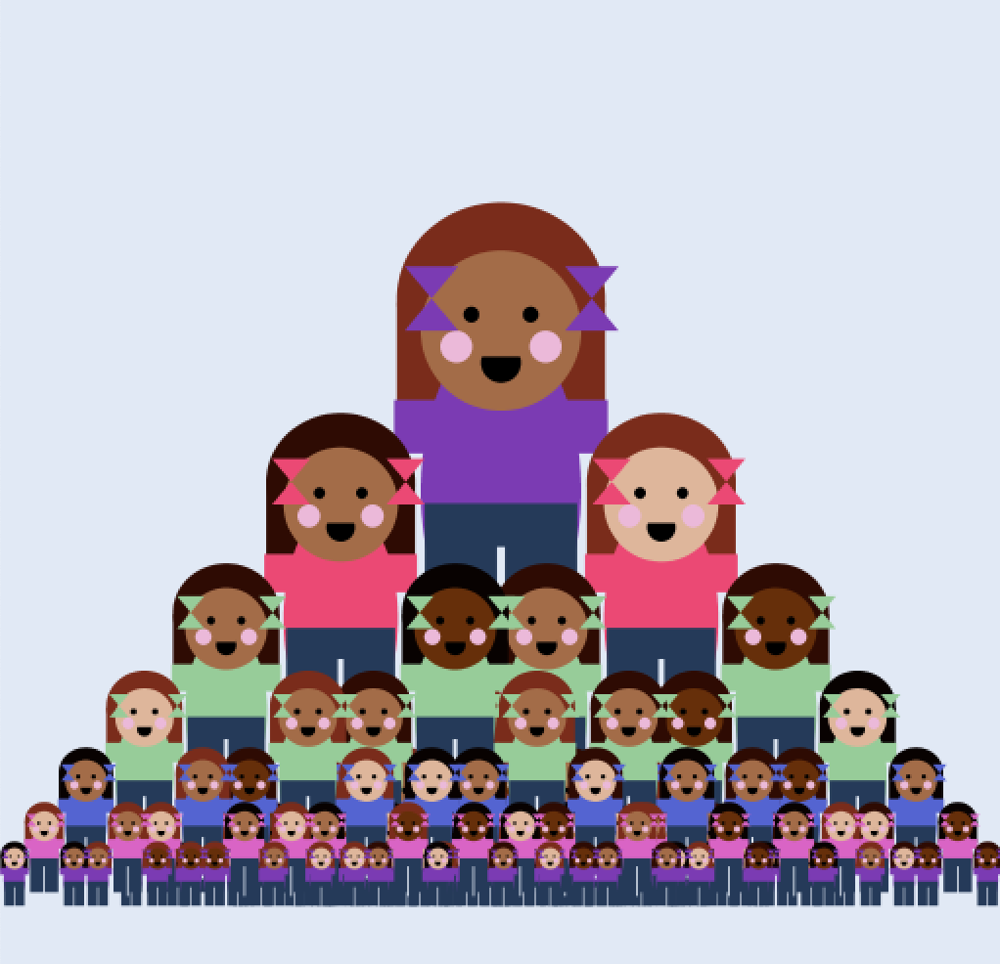

# 🎨 Recursive Doll Art in Java

This project generates a recursive pyramid of stylized figures using Java graphics. The image grows in size and complexity based on recursive logic to create a visually striking and scalable pattern of cartoon-like dolls.



---

## 🧠 Project Description

The program visually constructs a pyramid of cartoon figures in increasingly smaller sizes arranged in rows. Each figure is drawn programmatically using Java 2D graphics primitives and scaled proportionally based on recursive depth or loop iteration.

---

## 🗂 Files

| File | Description |
|------|-------------|
| `Art.java` | Contains the logic to draw individual figures and recursively stack them into a pyramid structure. |
| `ArtRunner.java` | Entry point that initializes the window and canvas to run the art generation. |
| `dolls.png` | Sample output of the program showing the recursive pyramid of figures. |

---

## ▶️ How to Run

1. **Compile the Java files:**

```bash
javac Art.java ArtRunner.java
```
2. **Run the program:
```
java ArtRunner
```
A GUI window will open displaying the recursive doll pyramid artwork.
